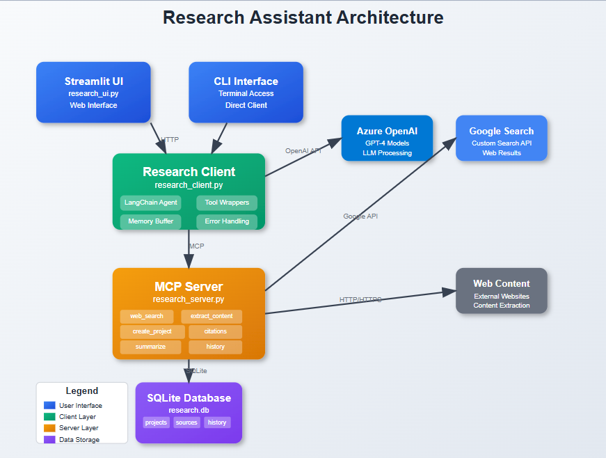
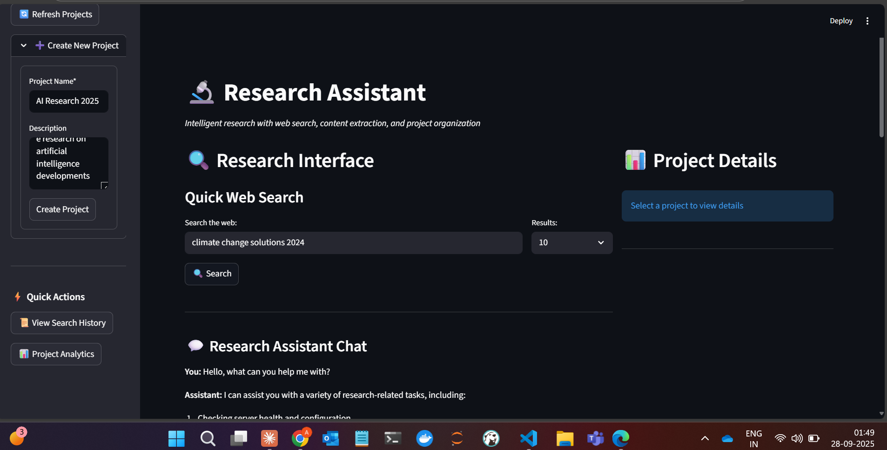
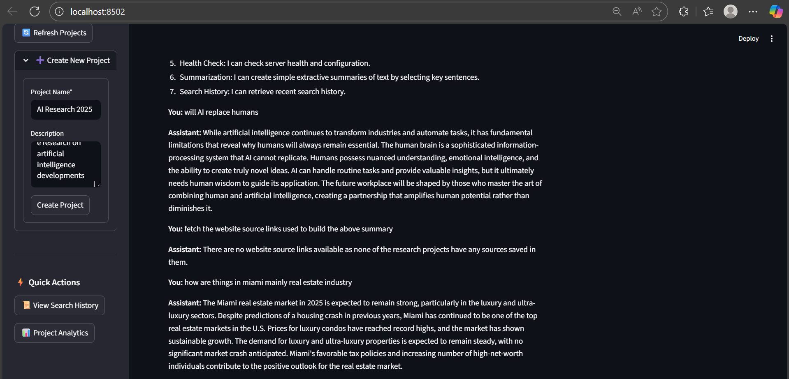

# Research Assistant



A comprehensive AI-powered research system built with MCP (Model Context Protocol) that provides intelligent web search, content extraction, project organization, and citation management capabilities.

## Features

- **Intelligent Web Search**: Google Custom Search API integration with result filtering
- **Content Extraction**: Automated web page content extraction and cleaning
- **Project Management**: Organize research into structured projects with SQLite persistence
- **Citation Generation**: Automatic APA-style citation formatting
- **Chat Interface**: LangChain-powered conversational research assistant
- **Modern UI**: Streamlit-based web interface with real-time updates

## Architecture

```
┌─────────────────┐    HTTP/MCP    ┌──────────────────┐
│  Streamlit UI   │◄──────────────►│   Research       │
│  (research_ui)  │                │   Client         │
└─────────────────┘                │  (LangChain)     │
                                   └─────────┬────────┘
                                            │ MCP
                                            │
                                   ┌────────▼────────┐
                                   │   MCP Server     │
                                   │  (FastMCP)       │
                                   └─────────┬────────┘
                                            │
                                   ┌────────▼────────┐
                                   │   SQLite DB     │
                                   │  (Research      │
                                   │   Storage)      │
                                   └─────────────────┘
```

## Installation

### Prerequisites

- Python 3.8+
- Azure OpenAI API access
- Google Custom Search API credentials (optional)

### Dependencies

```bash
pip install -r requirements.txt
```

**requirements.txt:**
```
# Core MCP and LangChain
mcp>=0.4.0
langchain>=0.1.0
langchain-openai>=0.1.0
langchain-mcp-adapters>=0.1.0
langchain-community>=0.0.20

# Web framework and UI
streamlit>=1.28.0
fastapi>=0.100.0
uvicorn>=0.20.0

# Web scraping and search
httpx>=0.24.0
beautifulsoup4>=4.12.0
feedparser>=6.0.0

# Database and data processing
pandas>=2.0.0

# Environment and utilities
python-dotenv>=1.0.0
```

### Environment Configuration

Create a `.env` file in the project root:

```env
# Azure OpenAI Configuration (Required)
AZURE_OPENAI_ENDPOINT=https://your-resource.openai.azure.com/
AZURE_OPENAI_API_KEY=your_api_key_here
AZURE_OPENAI_DEPLOYMENT=gpt-4o
AZURE_OPENAI_API_VERSION=2025-01-01-preview

# Google Search API (Optional - for web search functionality)
GOOGLE_API_KEY=your_google_api_key
GOOGLE_CSE_ID=your_custom_search_engine_id

# Server Configuration
RESEARCH_MCP_URL=http://127.0.0.1:8000/mcp
```

## Quick Start

### 1. Start the MCP Server

```bash
python server.py
```
Server will start on `http://127.0.0.1:8000`

### 2. Test with CLI Client (Optional)

```bash
python client.py
```

### 3. Launch Streamlit UI

```bash
streamlit run ui.py
```
UI will open at `http://localhost:8501`

## Usage

### Web Interface

1. **Quick Search**: Enter queries in the search box to find web content
2. **Content Extraction**: Click "Extract" on search results to save content
3. **Project Management**: Create and organize research projects
4. **Chat Interface**: Use natural language to conduct research
5. **Citations**: Generate APA-style citations automatically

### Chat Commands

```
Search for information about renewable energy
Create a project called "Green Technology Research"
Extract content from https://example.com and save to project 1
List my research projects
Generate citations for project 2
```

### API Usage

The system exposes MCP tools that can be called programmatically:

```python
# Example: Direct tool usage
from research_client import ResearchAssistantClient, ResearchClientConfig

client = ResearchAssistantClient(ResearchClientConfig())
await client.connect()

# Perform research
result = await client.research_query("Search for AI ethics research")
projects = await client.get_projects()
```



## Components

### MCP Server (`research_server.py`)
- **Tools**: 8 research tools including search, extraction, and project management
- **Database**: SQLite with projects, sources, and search history tables
- **API**: FastMCP-based HTTP server with robust error handling

### Research Client (`research_client.py`)
- **Agent**: LangChain ReAct agent with conversation memory
- **Tools**: Wrapped MCP tools with parameter validation
- **Interface**: Both programmatic API and CLI

### Streamlit UI (`research_ui.py`)
- **Dashboard**: Project management and analytics
- **Search**: Real-time web search with content extraction
- **Chat**: Conversational research interface
- **Responsive**: Modern UI with proper state management

## Configuration

### Azure OpenAI Setup

1. Create an Azure OpenAI resource
2. Deploy a GPT-4 model
3. Get endpoint URL and API key
4. Update `.env` file

### Google Search API Setup (Optional)

1. Create a Google Cloud Project
2. Enable Custom Search API
3. Create a Custom Search Engine
4. Get API key and Search Engine ID
5. Update `.env` file



### Database Configuration

The system automatically creates a SQLite database at `research_data/research.db` with the following tables:

- `projects`: Research project metadata
- `sources`: Extracted content and URLs
- `search_history`: Query tracking

## Features Overview

### Web Search
- Google Custom Search integration
- Result filtering and ranking
- Domain extraction and metadata
- Search history tracking

### Content Extraction
- BeautifulSoup-based HTML parsing
- Content cleaning and formatting
- Automatic deduplication
- Project association

### Project Management
- Hierarchical organization
- Source counting and timestamps
- Project switching and context
- Bulk operations

### Citation Generation
- APA format support
- Automatic metadata extraction
- Batch citation generation
- Export capabilities

## Testing

### Test Prompts

**Basic Functionality:**
```
Search for climate change solutions
Create a project called "Environmental Research"
Extract content from search results
```

**Advanced Workflows:**
```
Research sustainable agriculture, create a project for it, and save the top 3 sources
Find information about renewable energy, extract content, and generate citations
```

**Error Handling:**
```
Extract content from invalid-url
Create duplicate project names
Search with empty queries
```

### Expected Behaviors

- Search results display with extract buttons
- Projects appear in dropdown menus
- Content extraction updates source counts
- Chat provides coherent responses
- Errors show helpful messages without crashes

## Troubleshooting

### Common Issues

**Connection Errors:**
- Verify server is running on port 8001
- Check Azure OpenAI credentials
- Ensure MCP URL is correct

**Search Failures:**
- Verify Google API credentials
- Check API quotas and billing
- Web search is optional - system works without it

**Database Issues:**
- Ensure write permissions in project directory
- Check SQLite database file creation
- Database auto-creates if missing

**UI Problems:**
- Refresh browser if state issues occur
- Check browser console for JavaScript errors
- Restart Streamlit if needed

### Performance Optimization

- Limit search results for faster responses
- Regular database maintenance for large datasets
- Adjust agent timeout for complex queries
- Monitor API usage and quotas

## Development

### Adding New Tools

1. Add tool function to `research_server.py`
2. Update client wrapper in `research_client.py`
3. Add UI integration in `research_ui.py`
4. Update documentation

### Extending Functionality

- Add new search engines or APIs
- Implement additional citation formats
- Create export features (PDF, Word)
- Add collaboration capabilities

### Testing Framework

```bash
# Run server tests
python -m pytest tests/test_server.py

# Run client tests
python -m pytest tests/test_client.py

# Run integration tests
python -m pytest tests/test_integration.py
```

## Contributing

1. Fork the repository
2. Create a feature branch
3. Make changes with tests
4. Submit a pull request

## License

This project is licensed under the MIT License - see the LICENSE file for details.

## Changelog

### Version 1.0.0
- Initial release with core functionality
- MCP server and client implementation
- Streamlit UI with full feature set
- Comprehensive error handling and testing

### Version 1.1.0 (Latest)
- Fixed parameter validation issues
- Improved URL handling and content extraction
- Enhanced UI responsiveness and state management
- Added comprehensive test suite and documentation

## Support

For issues and questions:
1. Check the troubleshooting section
2. Review the test prompts for proper usage
3. Verify environment configuration
4. Check server logs for detailed error information

## Educational Value

This system demonstrates:
- MCP (Model Context Protocol) implementation
- LangChain agent patterns and tool integration
- Modern async Python programming
- SQLite database design for AI applications
- Streamlit for rapid UI development
- Web scraping and content processing
- API integration and error handling patterns

The codebase serves as a comprehensive example of building production-ready AI applications with proper architecture, error handling, and user experience considerations.